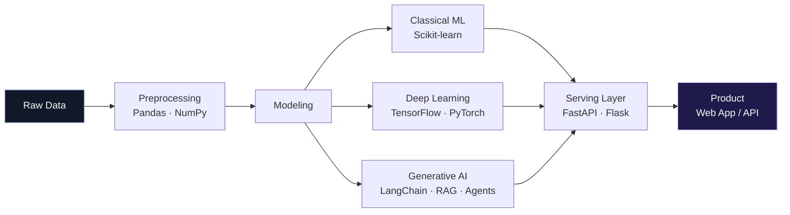

<div align="center">

```
┌─────────────────────────────────────────────────────────┐
│  MODEL CARD                                              │
│  anish-fathima-n / ai-engineer                           │
└─────────────────────────────────────────────────────────┘
```


# ANISH FATHIMA N
### `class AIEngineer(HumanIntelligence):`

<br>

| | |
|---|---|
| **Developed by** | Anish Fathima N |
| **Model type** | AI / ML Engineer · Generative AI Specialist |
| **Base architecture** | B.Tech, Artificial Intelligence & Data Science |
| **Languages** | Python, SQL, JavaScript |
| **Status** | `● training complete` `● accepting new deployments` |
| **Contact endpoint** | [linkedin](https://www.linkedin.com/in/anish-fathima-n-425340300) · [email](mailto:fanish050@gmail.com) · [github](https://github.com/Anis-h-coder) |

</div>

<br>

## 01 — Model Description

> Trained to read, reason, retrieve, predict, explain and respond.
> Specializes in turning unstructured problems into deployed, working systems —
> not just notebooks that end at 90% accuracy.

I build at the intersection of **Generative AI, Machine Learning, and applied Data Science**. Most of my work follows the same pipeline: understand the data, choose the right architecture, ship something a real user could actually open.

<br>

## 02 — Architecture



<br>

## 03 — Capabilities

<table>
<tr><td width="50%" valign="top">

**Generative AI & LLM Systems**
```
LangChain / LangGraph   ████████████░░  85%
RAG Pipelines           ███████████░░░  80%
AI Agents               ██████████░░░░  75%
Vector Search (FAISS,
ChromaDB, Pinecone)     ███████████░░░  80%
Prompt Engineering      █████████████░  90%
```

**Machine Learning**
```
Supervised Learning     █████████████░  90%
Unsupervised Learning   ███████████░░░  80%
Deep Learning (DL)      ███████████░░░  80%
Model Evaluation        ████████████░░  85%
```

</td><td width="50%" valign="top">

**NLP & Computer Vision**
```
Text Intelligence / NLP ███████████░░░  80%
YOLO / Object Detection ██████████░░░░  75%
Image Understanding     ██████████░░░░  75%
```

**Engineering**
```
Python                  █████████████░  90%
SQL                     ████████████░░  85%
FastAPI / Flask         ███████████░░░  80%
React.js                █████████░░░░░  70%
Git / GitHub            ████████████░░  85%
```

</td></tr>
</table>

<sub>Self-reported scores. Evaluated informally, on real projects, not benchmarks.</sub>

<br>

## 04 — Deployments

<sub>Live checkpoints from training. Each one solves an actual problem.</sub>

<table>
<tr>
<td width="50%" valign="top">

**`nexus-ai`** `● multi-agent`
Enterprise platform combining RAG, AutoML, NL-to-SQL and explainable ML in one agentic system.
`LLMs` `RAG` `Agents`
[→ inspect checkpoint](https://github.com/Anis-h-coder/NexusAI-Multi-Agent-Intelligence-Platform)

---

**`finlytics-ai`** `● analytics`
Personal finance intelligence — spending analysis, anomaly detection, spend forecasting.
`ML` `Gemini` `Analytics`
[→ inspect checkpoint](https://github.com/Anis-h-coder/Finlytics-AI-Intelligent-Personal-Finance-Analytics-Platform)

---

**`wanderlust-ai`** `● travel`
Travel intelligence system for destination discovery, booking flows and itinerary generation.
`Groq` `LLaMA` `Flask`
[→ inspect checkpoint](https://github.com/Anis-h-coder/Wanderlust-AI-Travel-Tourism-Management-System)

</td>
<td width="50%" valign="top">

**`lex-ai`** `● legal nlp`
Legal intelligence platform — document analysis, contract comparison, summarization, legal Q&A.
`LLMs` `NLP` `Legal AI`
[→ inspect checkpoint](https://github.com/Anis-h-coder/LexAI---AI-Powered-Legal-Intelligence-Platform)

---

**`querytalk-ai`** `● NL2SQL`
Converts natural language questions into SQL queries and visual analytics on the fly.
`AI` `SQL` `Data Viz`
[→ inspect checkpoint](https://github.com/Anis-h-coder/QueryTalk-AI---AI-Powered-Natural-Language-to-SQL-Analytics-Assistant)

---

**`archaeomap-ai`** `● vision`
YOLO-based computer vision system for soil classification and vegetation detection.
`YOLO` `CV` `Deep Learning`
[→ inspect checkpoint](https://github.com/Anis-h-coder/ArchaeoMap-AI-YOLO-Based-Soil-Classification-and-Vegetation-Detection)

</td>
</tr>
</table>

<br>

## 05 — Training in Progress

<sub>Next checkpoints. Weights still updating.</sub>

```
[■■■■■■■■□□] Agentic AI Systems
[■■■■■■■□□□] Advanced RAG Architectures  
[■■■■■■□□□□] LLM Evaluation & Guardrails
[■■■■■□□□□□] Multi-Agent Orchestration
[■■■■■■■■□□] AI Product Engineering
```

<br>

## 06 — Inference Example

```python
from anish import Engineer

engineer = Engineer(name="Anish Fathima N")

response = engineer.respond(
    prompt="I have a problem that needs an AI system built around it.",
    mode="collaborate"
)

print(response)
# >> "Send the details — let's scope it: research → prototype → product."
```

<br>

---

<div align="center">

**Research → Prototype → Product.**

[](https://www.linkedin.com/in/anish-fathima-n-425340300)
[](mailto:fanish050@gmail.com)
[](https://github.com/Anis-h-coder)

<sub>model card last updated · 2026</sub>

</div>
